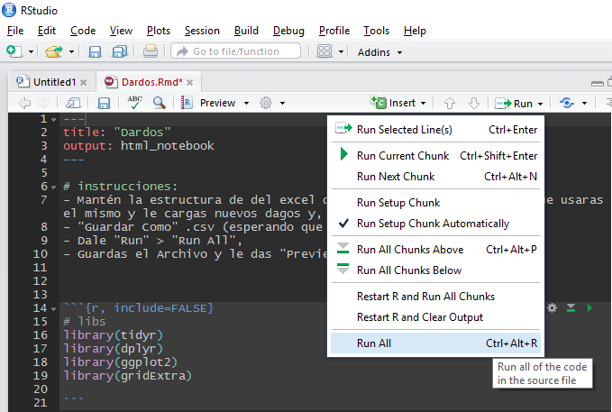
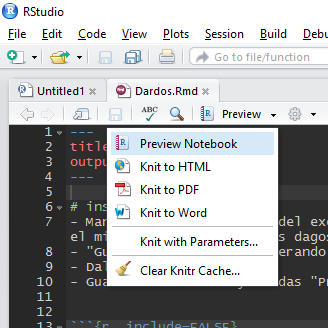

# instrucciones:
- Descarga la carpeta "Dardos",
- Usa el archivo "Dardos.csv" dentro de la carpeta data para relevar el puntaje, guarda y cierralo,
- Abre el archivo "Dardos.Rmd",
- Dale "Run" > "Run All":  
  

- Guardas el Archivo y le das "Preview":  


- Abre el archivo "Dardos.nb.html" que se generó,
- Enjoy...
- Comparte el nootebook: https://github.com/lahgzz/data4rh/tree/master/learning/dardos


```{r, include=FALSE}
# libs... instalar antes de la primera corrida 
library(tidyr)
library(dplyr)
library(ggplot2)
library(gridExtra)

```

## get data
```{r}
# get raw data
dardos.raw <- read.csv2('data/Dardos.csv')

# show raw data
dardos.raw

```

## prepare data
```{r}
# gather data
dardos.work <- gather(dardos.raw, INTENTO, PUNTAJE, 5:12, -c(1:4))

# prepare data
dardos.work$INTENTO <- as.integer(gsub('INTENTO.', "", dardos.work$INTENTO))

# show working data
dardos.work

```

# Explore
## Puntaje
```{r, fig.height=4, fig.width=12}
summary(dardos.work$PUNTAJE)
p1 <- ggplot(dardos.work, aes(y = PUNTAJE, x = '')) + geom_boxplot()
p2 <- ggplot(dardos.work, aes(x = PUNTAJE)) + geom_histogram(bins = 10)
grid.arrange(p1, p2, ncol = 2)

```

## puntaje by intento
### como fue el puntaje por intento?
```{r}
# data
dardos.work %>% 
  group_by(INTENTO) %>% 
  summarise(PUNTAJE=sum(PUNTAJE)) %>% 
  as.data.frame() %>% 
  arrange(-PUNTAJE)

# plot
ggplot(dardos.work, aes(x=INTENTO)) + 
  geom_bar(aes(y=PUNTAJE), stat = 'identity')

```
### como se distribuyo por intento?
```{r}
# plot
ggplot(dardos.work, aes(x=INTENTO, group=INTENTO)) + 
  geom_boxplot(aes(y=PUNTAJE))

```

### como evoluciono cada intento?
```{r}
# plot
dardos.work %>% group_by(INTENTO) %>% summarise(PUNTAJE=sum(PUNTAJE)) %>%
  ggplot(aes(x=INTENTO)) + 
  geom_point(aes(y=PUNTAJE)) + geom_line(aes(y=PUNTAJE)) +
  geom_smooth(aes(y=PUNTAJE), method = 'lm', se = F)

```


## puntaje by participante
### quien acumulo mas puntos?
```{r}
# data
dardos.work %>% 
  group_by(PARTICIPANTE) %>% 
  summarise(PUNTAJE=sum(PUNTAJE)) %>% 
  as.data.frame() %>% 
  arrange(-PUNTAJE)

# plot
ggplot(dardos.work, aes(x=PARTICIPANTE, fill=PARTICIPANTE)) + 
  geom_bar(aes(y=PUNTAJE), stat = 'identity')

```
### como se distribuyo por cada intento?
```{r}
# plot
ggplot(dardos.work, aes(x=INTENTO, fill=PARTICIPANTE)) + 
  geom_bar(aes(y=PUNTAJE), position = 'fill', stat = 'identity')

```
### como se distribuyo por participante?
```{r}
# plot
ggplot(dardos.work, aes(x=PARTICIPANTE, fill=PARTICIPANTE)) + 
  geom_boxplot(aes(y=PUNTAJE))

```
### como evoluciono cada participante?
```{r}
# plot
ggplot(dardos.work, aes(x=INTENTO, col=PARTICIPANTE)) + 
  geom_point(aes(y=PUNTAJE)) + geom_line(aes(y=PUNTAJE)) +
  geom_smooth(aes(y=PUNTAJE), method = 'lm', se = F) +
  facet_grid(PARTICIPANTE ~ ., scales = 'free')
```

## puntaje by sexo
### que grupo anotó mas?
```{r}
# data
dardos.work %>% 
  group_by(SEXO) %>% 
  summarise(PUNTAJE=sum(PUNTAJE)) %>% 
  as.data.frame() %>% 
  arrange(-PUNTAJE)

# plot
ggplot(dardos.work, aes(x=SEXO, group=SEXO, fill=SEXO)) + 
  geom_bar(aes(y=PUNTAJE), stat = 'identity')
```

### como se distribuyo por intento?
```{r}
# plot
ggplot(dardos.work, aes(x=INTENTO, fill=SEXO)) + 
  geom_bar(aes(y=PUNTAJE), position = 'fill', stat = 'identity')

```

### como se distribuyo por sexo?
```{r}
# plot
ggplot(dardos.work, aes(x=SEXO, fill=SEXO)) + 
  geom_boxplot(aes(y=PUNTAJE))

```

### como evolucionaron?
```{r}
# plot
dardos.work %>% group_by(SEXO, INTENTO) %>% summarise(PUNTAJE=sum(PUNTAJE)) %>%
  ggplot(aes(x=INTENTO, col=SEXO)) + 
  geom_point(aes(y=PUNTAJE)) + geom_line(aes(y=PUNTAJE)) +
  geom_smooth(aes(y=PUNTAJE, group=SEXO), method = 'lm', se = F) +
  facet_grid(SEXO ~ ., scales = 'free')

```

